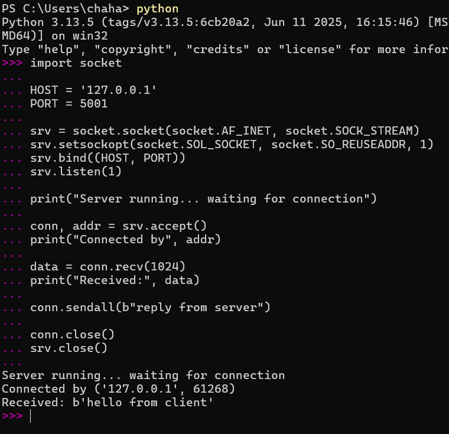
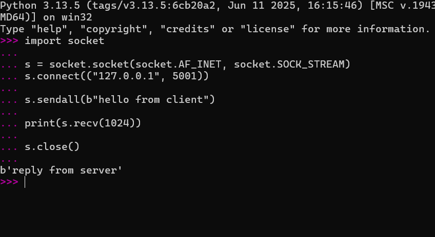
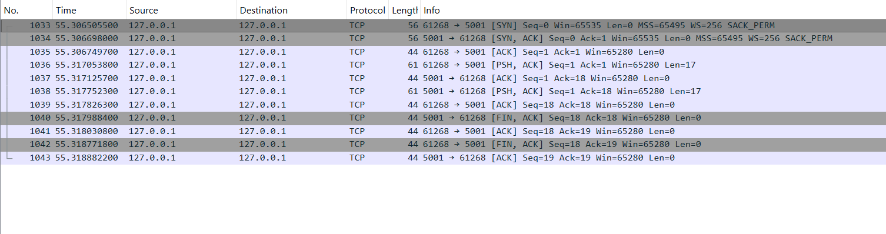
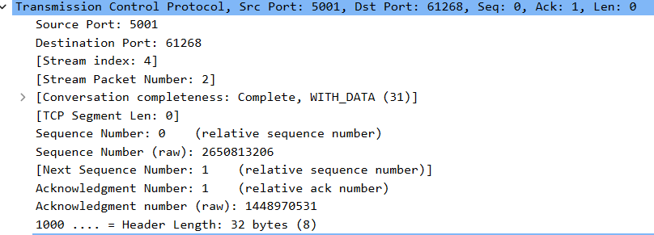
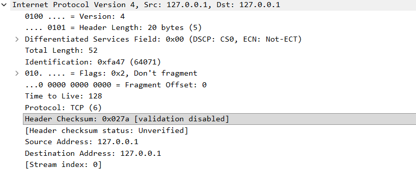

# Week 13 — From Code to Wire: Full Stack Packet Analysis

## Overview

In this artifact, I generated my own network traffic using a TCP client and server written in Python, and then captured and analyzed that traffic using Wireshark. Earlier in the semester, I mainly focused on observing packets, but this time I created the traffic myself and then traced it through the network stack. This connects Lecture 21 and Lecture 22 by showing how network behavior can be both created and observed.

The goal of this artifact is to understand how a simple message moves through different layers of the network stack, from application code down to TCP and IP.

---

## Step 1 — Generating Traffic (TCP Sockets)

I implemented a basic TCP server and client. The client sends the message **"hello from client"**, and the server responds with **"reply from server"**.

The following shows the client sending data:



The server successfully receives the message and responds:



This confirms that a full TCP connection was established and data was exchanged between the two processes.

---

## Step 2 — Capturing Traffic (Wireshark)

I used Wireshark to capture traffic on the loopback interface and filtered for:

```
tcp.port == 5001
```

This allowed me to isolate only the packets involved in my client-server communication.

---

## Step 3 — TCP Handshake Analysis

The following screenshot shows the TCP three-way handshake:



From this, we can see:

* `[SYN]` from the client
* `[SYN, ACK]` from the server
* `[ACK]` from the client

This confirms that TCP establishes a connection before any data is transmitted.

I also noticed that the client uses a temporary (ephemeral) port, while the server listens on port 5001, which reflects how real-world TCP connections are set up.

---

## Step 4 — Data Transmission (TCP Layer)

The following shows a TCP packet carrying actual data:



Packets labeled `[PSH, ACK]` contain the application data. In this case:

* the client sends "hello from client"
* the server sends back "reply from server"

This shows how application data is encapsulated inside TCP segments.

---

## Step 5 — Network Layer (IP)

The following shows the IP layer of one of the packets:



From this:

* Source IP: 127.0.0.1
* Destination IP: 127.0.0.1
* TTL: 128

Since this is loopback traffic, the packet never leaves the machine. However, the IP layer is still present, which shows that the full protocol stack is used even for local communication.

---

## Key Takeaways

This artifact made the networking stack feel much more concrete. Instead of thinking about TCP, IP, and application layers separately, I could see how they all exist together within a single packet.

A message written in Python becomes:

* application data
* wrapped inside a TCP segment
* wrapped inside an IP packet

I also saw the full lifecycle of a TCP connection, including the handshake, data transfer, and connection termination. This helped connect the concepts from lecture to actual behavior on my machine.

---

## AI Usage

For this artifact, I used ChatGPT to help structure the workflow, generate example socket code, and connect the steps between traffic generation and packet analysis. I used it as a guide to better understand how the tools and concepts relate to each other, rather than just copying outputs. I then refined the explanations based on what I observed in my own packet capture so that the final work reflects my understanding.
